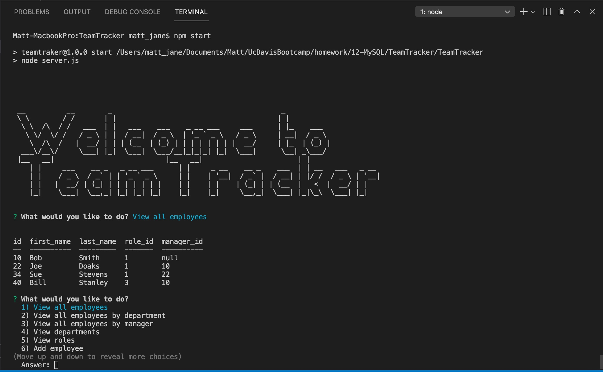

# TeamTracker

[](https://opensource.org/licenses/MIT)

TeamTracker is a Node.js-based content management system (CMS) that enables you to manage a company's employees. See [Description](#description) below for more information.

## Table of Contents

&nbsp;&nbsp;&nbsp;&nbsp;&nbsp;[Description](#description)<br/>
&nbsp;&nbsp;&nbsp;&nbsp;&nbsp;[Installation](#installation)<br/>
&nbsp;&nbsp;&nbsp;&nbsp;&nbsp;[Usage](#usage)<br/>
&nbsp;&nbsp;&nbsp;&nbsp;&nbsp;[License](#license)<br/>
&nbsp;&nbsp;&nbsp;&nbsp;&nbsp;[Contributing](#contributing)<br/>
&nbsp;&nbsp;&nbsp;&nbsp;&nbsp;[Questions](#questions)<br/>
&nbsp;&nbsp;&nbsp;&nbsp;&nbsp;[Screenshot](#screenshot)<br/>

## Description

The TeamTracker CMS enables you to view, add, and remove employees, departments, and roles. It also enables you to see salary expeditures for different departments. TeamTracker is built using the following technologies:

- [Node.js](https://nodejs.org/), which is the JavaScript runtime used for the server.
- The [mysql](https://www.npmjs.com/package/mysql) npm package (a "Node.js driver for MySQL) to interface with the MySQL database.
- The [inquirer](https://www.npmjs.com/package/inquirer) npm package for prompting users for input.
- The [console.table](https://www.npmjs.com/package/console.table) npm package to format tables written to the console.
- The [dotenv](https://www.npmjs.com/package/dotenv) npm package to hide user and password information for MySQL.

TeamTracker accesses a MySQL database named teamtrack_db. The code to create and use this database is in /db/teatrackDB.sql. Code to seed this database is in /db/seeds.sql, which can be run by using the following command:
```
   node ./db/seeds.sql
```

## Installation 

To install TeamTracker, 

1. Clone this repository.
2. At a command prompt in the root directory for the project, run the following command, which will install the npm packages listed above:
```
   npm install
```
3. Create a MySQL database as describe in [Description](#description) above. The port used for this is 3306 (as defined in server.js).

## Usage 

To run enter the following at a command prompt in the root directory for the project: 
```
npm start    
```

## License

The TeamTracker project is covered under The MIT License. Click the license badge below for information on this license:

[](https://opensource.org/licenses/MIT)

## Contributing

In general, outside contributions are not being accepted since this project is for educational purposes. 

## Questions

Send questions to mjlinder218@gmail.com. 
For more information about the developer, see https://github.com/mlin901.

## Screenshot 

